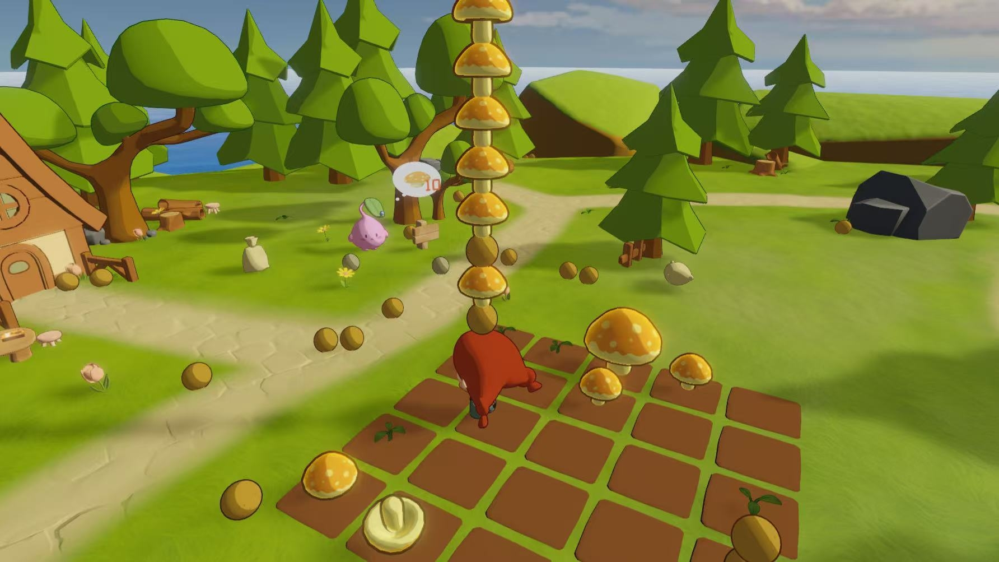
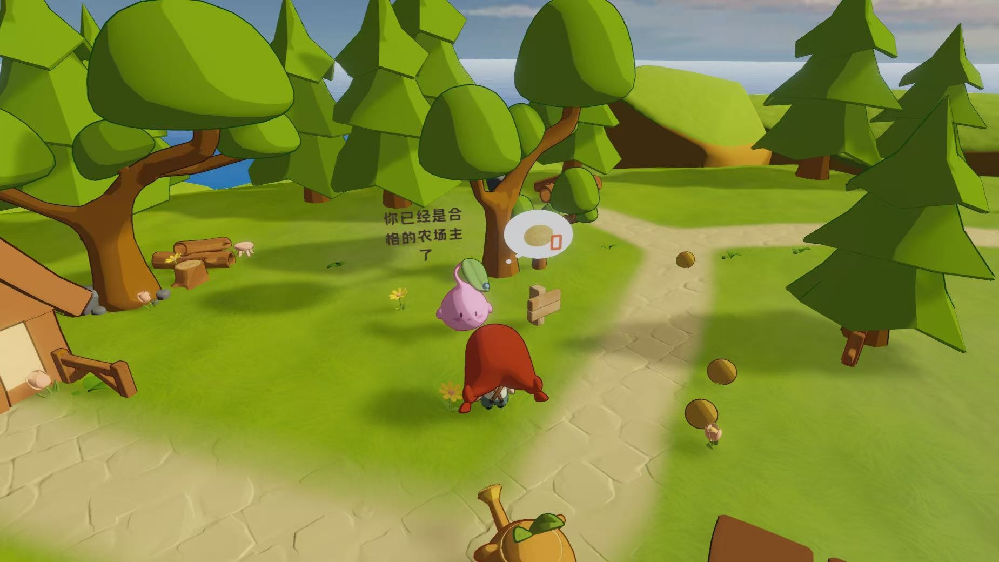
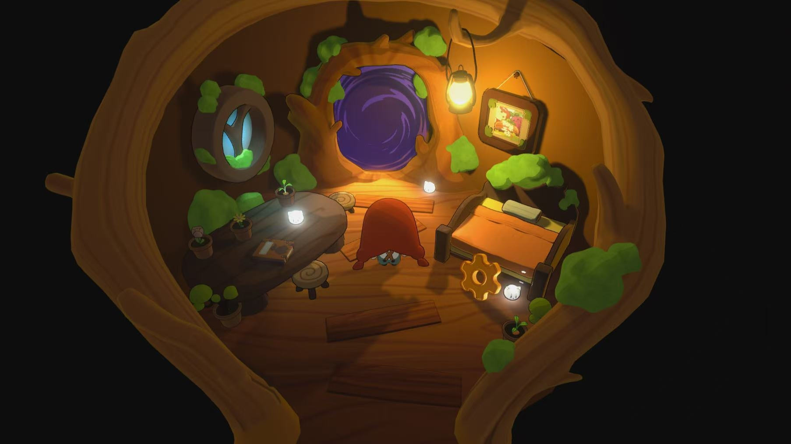

# 《叮咚-甜菜岛》GameJam 作品记录

## 📌 项目概况
*   **比赛时间**：2025年10月-11月
*   **团队规模**：15人（策划：系统策划两名、文案策划一名；美术：原画两名、3D建模三名、技术美术一名、骨骼动作一名；程序：三名程序；音乐：两名音乐制作者）
*   **我的职责**：文案策划、账户运营、内容测试

## 🎯 我的核心工作
**策划**：策划团体共同设计游戏玩法，写明策划案并进行策划案先行，沟通程序白模试玩
**内容设计**：负责世界观、角色、道具等文本内容，产出形象参考、动画分镜头脚本等内容
**社媒运营**：负责撰写开发者日志，运营官号，编写小红书文案并且协助管理玩家群

## 📂 项目文件导航
为了方便查看，我把相关资料整理在下方：
*   👉 **[点击这里查看配表信息](GameJam/3D休闲游戏/产出（策划案、分镜等）)** 
*   👉 **[点击这里查看分镜头脚本](GameJam/3D休闲游戏/产出（策划案、分镜等）/分镜.docx)** 

## 🖼️ 游戏画面展示
*)*
*)*
*)*

## 🎬 游戏演示与下载

欢迎前往 TapTap 查看游戏详情、下载体验并留下您的宝贵建议：

👉 **[点击前往 TapTap 查看《叮咚-甜菜岛》](🎮 https://tap.cn/lpLoeznrj )**
